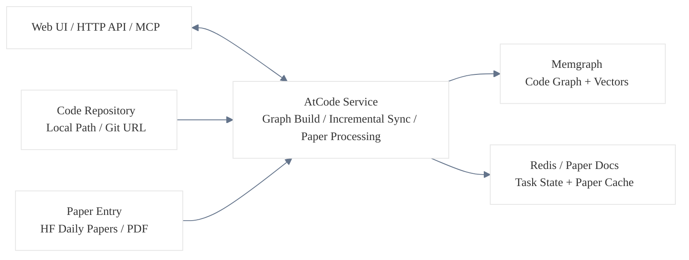

<div align="center">
<div style="margin-top: 10px; margin-bottom: -60px;">
  
</div>

# AtCode

**AI code knowledge graph for code understanding, graph retrieval, and agent workflows**

*Turn a code repository into a queryable AST knowledge graph so AI can reason through structure, call chains, and dependencies instead of relying only on text chunks.*

<p>
  <a href="LICENSE"></a>
  <a href="https://www.python.org/"></a>
  <a href="https://nextjs.org/"></a>
  <a href="https://memgraph.com/"></a>
</p>

[English](README.md) | [简体中文](README_CN.md)

</div>

---

AtCode is a local-first code intelligence system. It uses Tree-sitter to build an AST knowledge graph for a repository, stores it in Memgraph, and exposes graph capabilities through a Web UI, HTTP API, and MCP. It is designed for cross-file structural understanding, paper-to-code analysis, and agent integration on medium and large codebases.

---

## Quick Start

> Note: each startup mode below keeps the shortest runnable command path. More operational details, restart guidance, and management notes are folded under expandable sections.

### Prerequisites

| Dependency | Notes |
| :--- | :--- |
| **cmake** | Required to build `pymgclient`. Linux: `sudo apt install cmake build-essential`; macOS: `brew install cmake` |
| **Docker** | Linux: install Docker Engine and Docker Compose; macOS / Windows: install [Docker Desktop](https://www.docker.com/products/docker-desktop/) |
| **uv** | Python package manager. Install with `curl -LsSf https://astral.sh/uv/install.sh \| sh` |
| **nvm / npm** | Node.js version management. Install with `curl -o- https://raw.githubusercontent.com/nvm-sh/nvm/v0.40.3/install.sh \| bash && nvm install --lts` |

### Option 1: One-command startup (recommended)

```bash
git clone https://github.com/siorigin/atcode.git
cd atcode
cp .env.example .env
# Edit .env and fill in at least LLM_API_KEY / LLM_MODEL.
# See .env.example comments for the rest of the options.

./atcode.sh up
```

`atcode.sh` automatically detects and installs missing dependencies such as `uv`, Node.js, and `cmake`, starts the infrastructure services (Memgraph and Redis), installs backend and frontend dependencies, and launches the full stack.

<details>
<summary>Click to expand: common <code>atcode.sh</code> management commands</summary>

```bash
./atcode.sh status   # Show service status
./atcode.sh logs     # Show logs
./atcode.sh refresh  # Restart frontend/backend only; keep Memgraph/Redis running
./atcode.sh down     # Stop all services
```

</details>

### Option 2: Full Docker deployment (frontend and backend both in containers)

If you want Docker to manage the frontend, backend, Memgraph, and Redis together, use [`docker/compose.full.yaml`](./docker/compose.full.yaml):

```bash
git clone https://github.com/siorigin/atcode.git
cd atcode
cp .env.example .env
# Edit .env and fill in at least LLM_API_KEY / LLM_MODEL.
# See .env.example comments for the rest of the options.

docker compose -p atcode -f docker/compose.full.yaml up -d --build
docker compose -p atcode -f docker/compose.full.yaml ps
```

> These examples pin `-p atcode` explicitly so Docker Compose updates the existing AtCode stack instead of accidentally creating a second project such as `docker-*`. If `.env` already contains `COMPOSE_PROJECT_NAME=atcode`, you may omit `-p atcode`.

> If your host only has legacy `docker-compose`, replace `docker compose` with `docker-compose`.

> `backend`, `frontend`, and `redis` now support `HOST_UID` / `HOST_GID`. `atcode.sh` and `./scripts/docker_compose_with_mounts.sh` auto-detect them; for plain manual `docker compose`, you can set them in `.env` or export them in the shell first.

> `lab` is now an optional debugging UI. It is not started by default, so a busy port `3000` will not interrupt the main stack. Start it only when needed with `docker compose -p atcode -f docker/compose.full.yaml --profile lab up -d lab`.

Default access URLs:

- Frontend: `http://localhost:3007` (controlled by `PORT` in `.env`)
- Backend: `http://localhost:8008` (controlled by `API_PORT` in `.env`)
- MCP: `http://localhost:8008/mcp`

> If you changed `PORT` to `3008` in `.env`, the frontend entry becomes `http://localhost:3008`.

<details>
<summary>Click to expand: restart, operations, data, and MCP notes for full Docker mode</summary>

- Runtime model:
  the frontend image runs `npm ci && npm run build` during image build and starts with `node start.js`; the backend runs FastAPI with a single worker and no `--reload`. This mode is suitable for demos, LAN access, and MCP integration, but it does not provide hot reload. Source code is not bind-mounted into the containers, but the project root `./data` directory is synchronized into the containers at `/app/data`.

- Bind-mount parameters:
  `ATCODE_DATA_DIR` controls the host path mounted to `/app/data` in `backend` and `frontend`; `REDIS_DATA_DIR` controls the host path mounted to `/data` in `redis`. Absolute paths are recommended when moving data onto another disk.

- Update model:
  because source code is baked into the images, `restart` only restarts the existing container process. If frontend or backend code changed, you must use `up -d --build` for that service.

- Choose the update command based on the scope of your change:

| Change type | Command |
|---------|------|
| Frontend code or frontend Dockerfile changed | `docker compose -p atcode -f docker/compose.full.yaml up -d --build --no-deps frontend` |
| Backend code or backend Dockerfile changed | `docker compose -p atcode -f docker/compose.full.yaml up -d --build --no-deps backend` |
| Frontend and backend code both changed | `docker compose -p atcode -f docker/compose.full.yaml up -d --build backend frontend` |
| Code unchanged, only restart process | `docker compose -p atcode -f docker/compose.full.yaml restart <service>` |
| Only runtime variables in `.env` changed | `docker compose -p atcode -f docker/compose.full.yaml up -d --force-recreate --no-deps <service>` |
| Build-time frontend variables in `.env` changed (such as `NEXT_PUBLIC_*`) | `docker compose -p atcode -f docker/compose.full.yaml up -d --build --no-deps frontend` |

> If you changed `API_PORT`, use `docker compose -p atcode -f docker/compose.full.yaml up -d --build backend frontend`, because the backend port mapping changes and the frontend build/runtime config also changes.

> If you are unsure, use `docker compose -p atcode -f docker/compose.full.yaml up -d --build backend frontend`.

- Extra host directory mounts:
  if you want containers to see additional host disks such as `/data_gpu` or `/share_data`, use `./scripts/docker_compose_with_mounts.sh`. It auto-detects `HOST_UID` / `HOST_GID`, keeps the same Compose project name, and adds extra bind mounts only for the requested run.

```bash
./scripts/docker_compose_with_mounts.sh \
  --mount /data_gpu:/host/data_gpu:ro \
  --mount /share_data:/host/share_data:rw \
  -- up -d --build --no-deps frontend
```

  By default, extra mounts are attached to `backend` and `frontend`. Use `--service backend` or `--service frontend` if you want to limit them to specific services.

- Common management commands:

```bash
docker compose -p atcode -f docker/compose.full.yaml ps        # Show status
docker compose -p atcode -f docker/compose.full.yaml logs -f    # Show logs; optionally append backend / frontend
docker compose -p atcode -f docker/compose.full.yaml down       # Stop and remove containers
```

- Data behavior:
  the project root `./data` directory is synchronized with `/app/data` in the containers, so generated docs, cloned repositories, chat logs, and similar files are written directly to the host `data/` directory. `down -v` only removes the Redis volume; it does not remove host `./data`. The Memgraph graph database itself is not stored under `./data`.

- MCP:
  this mode already includes the HTTP MCP endpoint, so no separate MCP container is required. See the "Connect to AI coding tools (MCP)" section below for integration commands. For LAN access, replace `localhost` with the actual machine IP.

</details>

### Option 3: Manual step-by-step startup (better for development and debugging)

```bash
# 1. Clone and configure
git clone https://github.com/siorigin/atcode.git
cd atcode
cp .env.example .env          # Edit .env and fill in at least LLM_API_KEY / LLM_MODEL

# 2. Start infrastructure
docker compose -f docker/compose.yaml up -d
docker compose -f docker/compose.yaml ps              # Confirm memgraph and redis are running; lab is optional

# 3. Install and start the backend
uv sync --extra all
uv run ./scripts/start_api.sh --dev
# Verify: curl http://localhost:8008/api/health

# 4. Install and start the frontend (in a new terminal)
cd frontend && npm install && cd ..
./scripts/start_front.sh --prod        # Closer to full Docker mode; use --dev for hot reload during UI work
```

> Legacy `docker-compose` is also supported here: replace `docker compose` with `docker-compose`. If you need a stable project name, use `COMPOSE_PROJECT_NAME=atcode` in `.env` or append `-p atcode`.

> If you want Memgraph Lab, start it separately with `docker compose -f docker/compose.yaml --profile lab up -d lab`.

> **Windows:** do not use `scripts/start_api.sh` for the backend. Use `cd backend && uv run python -m api.run --host 127.0.0.1 --port 8008` instead.
>
> **Frontend mode choice:** `--prod` usually feels smoother and matches the full Docker mode more closely; `--dev` is the script default, enables hot reload, and is better for active UI iteration, but can feel slower on large pages.

Open `http://localhost:3007` in the browser. LAN access via `http://<your-ip>:3007` is also supported.

### Index your first project

After the services are up, you need to index a repository before analysis can begin.

1. Open `http://localhost:3007/repos` (or `http://<your-ip>:3007/repos`)
2. Click **Add Repository**
3. Choose a local path or a Git URL
4. Wait for graph construction to complete

> **Monorepo tip:** if you only need part of a repository, specify a subdirectory while adding it.

### Connect to AI coding tools (MCP)

Once the graph is ready, you can connect AtCode to AI coding tools that support MCP. For LAN access, replace `localhost` with the actual machine IP.

**Claude Code:**

```bash
# Default (current-directory scope)
claude mcp add --transport http atcode http://localhost:8008/mcp
# Project scope / user scope
claude mcp add --transport http --scope project atcode http://localhost:8008/mcp
claude mcp add --transport http --scope user    atcode http://localhost:8008/mcp
```

**Codex:**

```bash
codex mcp add atcode --url http://localhost:8008/mcp
```

> Please refer directly to the comments in [`.env.example`](./.env.example) for configuration details. In most cases, your first startup only requires `LLM_API_KEY` and `LLM_MODEL`.

---

## System Architecture



> **Code path:** once a repository enters AtCode, it goes through either a full graph build or incremental synchronization, and the result is written into Memgraph.
>
> **Paper path:** papers currently come mainly from Hugging Face Daily Papers, but PDF input is also supported. During processing, reading documents are cached, and when a GitHub repository is discovered, the same graph-building pipeline is reused.
>
> **Access surface:** the Web UI, HTTP API, and MCP all talk to the same backend capabilities.

---

## Language Support

To analyze languages beyond Python, install: `uv sync --extra treesitter-full`

| Language | Support tier | Notes |
| :--- | :--- | :--- |
| **Python** | Tier 1 | Most mature and the recommended validation language |
| **JavaScript / TypeScript** | Tier 2 | Usable; validate on your own project first |
| **Java** | Tier 2 | Usable, with more edge cases than Python |
| **C++ / Rust / Go** | Tier 2 | Usable, but less mature than Python |
| **Lua** | Experimental | Partial support only |

---

## Core Tools

AtCode exposes the following graph capabilities through MCP and the internal tool layer:

| Tool | Description |
| :--- | :--- |
| `explore_code` | Get source code, callers, callees, and dependency trees |
| `find_nodes` | Search for functions, classes, and methods by keyword, glob, or regex |
| `find_calls` | Inspect call relationships (incoming / outgoing) |
| `trace_dependencies` | Trace call, import, and inheritance paths |
| `find_class_hierarchy` | Inspect class inheritance relationships |
| `get_children` | Browse project, directory, file, and class-member structure |
| `get_code_snippet` | Lightweight source lookup for a single symbol |
| `read_file` | Read files directly or search file content by pattern |
| `list_repos` / `set_project` | Discover and switch project context |
| `manage_graph` | Build graphs, rebuild graphs, and inspect task status |
| `manage_repo` | Add, remove, and clean repository data |
| `sync` | Start, stop, or manually run incremental sync |
| `git` | Checkout, fetch, pull, and list refs |
| `search_papers` / `read_paper` | Discover papers from Hugging Face Daily Papers or the local paper store, read them, and build related code graphs |
| `check_health` | Check database state and project context health |

---

## Real-Time Incremental Sync

AtCode can incrementally update the graph as code changes, so AI does not reason over stale structure.

| Feature | Description |
| :--- | :--- |
| File monitoring | Low-latency file watching with polling fallback |
| Definition-level diff | Only changed functions and classes are updated |
| Initial sync | Picks up edits made while the watcher was offline |
| Distributed state | Redis-backed sync state for multi-worker setups |

---

## Optional Dependencies

Most users only need:

```bash
uv sync --extra all        # Recommended; installs all extras except semantic
```

If you want to self-host an embedding model, install the heavier `semantic` extra as well:
`uv sync --extra all --extra semantic`

---

## FAQ

**`pymgclient` build fails**
- Make sure `cmake` and the compiler toolchain are installed. On Linux: `sudo apt install cmake build-essential libssl-dev`.

**`docker compose up` has port conflicts**
- Check whether `3000`, `6379`, `7444`, or `7687` are already in use. Override ports in `.env` if needed.

**Graph build fails**
- If embeddings are not configured yet, build with `skip_embeddings=true`.
- If you use `gemini` or `ollama`, configure `EMBEDDING_*` separately before enabling embeddings.

**Frontend cannot reach the backend**
- Confirm `curl http://localhost:8008/api/health` works.
- Open `http://localhost:3007` or `http://<your-ip>:3007` in the browser, not `0.0.0.0`.

---

## Technical Details

For deeper internals, see **[Technical Deep Dive](./docs/TECHNICAL_DETAILS.md)**, which covers agent design, graph construction, incremental synchronization, and more.

---

## ToDo

- [ ] Integrate stronger web search and external knowledge grounding

---

## Contributing

Please see [CONTRIBUTING.md](CONTRIBUTING.md).

---

## License

This project is licensed under Apache License 2.0. See [LICENSE](LICENSE) for details.

The project also includes derived code from [code-graph-rag](https://github.com/vitalek84/code-graph-rag), which is licensed under MIT. See [NOTICE](NOTICE) for details.
