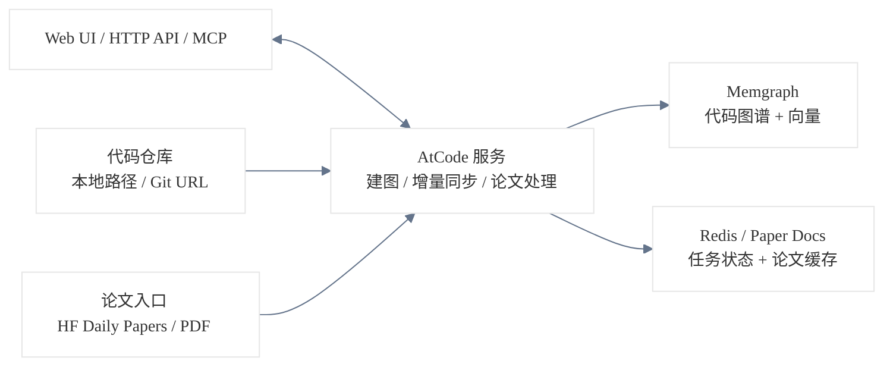

<div align="center">
<div style="margin-top: 10px; margin-bottom: -60px;">
  
</div>

# AtCode

**AI 代码知识图谱 —— 代码理解、图谱检索与 Agent 工作流**

*将代码仓库转化为可查询的 AST 知识图谱，让 AI 沿着结构、调用链和依赖关系理解代码，而非仅依赖文本切片。*

<p>
  <a href="LICENSE"></a>
  <a href="https://www.python.org/"></a>
  <a href="https://nextjs.org/"></a>
  <a href="https://memgraph.com/"></a>
</p>

[English](README.md) | [简体中文](README_CN.md)

</div>

---

AtCode 是一个本地优先的代码智能系统。它基于 Tree-sitter 将代码仓库构建为 AST 知识图谱，存储在 Memgraph 中，并通过 Web UI、HTTP API 和 MCP 暴露图谱能力，适用于中大型代码库的跨文件结构理解、论文联动分析与 Agent 集成。

---

## 快速开始

> 说明：下面每种启动方式都保留了“最短可执行命令”。更详细的运行机制、重启方法和管理说明已折叠，可点击展开。

### 前置条件

| 依赖 | 说明 |
| :--- | :--- |
| **cmake** | 编译 `pymgclient` 所需。Linux: `sudo apt install cmake build-essential`；macOS: `brew install cmake` |
| **Docker** | Linux: 安装 Docker Engine 及 Docker Compose；macOS / Windows: 安装 [Docker Desktop](https://www.docker.com/products/docker-desktop/) |
| **uv** | Python 包管理器。安装: `curl -LsSf https://astral.sh/uv/install.sh \| sh` |
| **nvm / npm** | Node.js 版本管理。安装: `curl -o- https://raw.githubusercontent.com/nvm-sh/nvm/v0.40.3/install.sh \| bash && nvm install --lts` |

### 方式一：一键启动（推荐）

```bash
git clone https://github.com/siorigin/atcode.git
cd atcode
cp .env.example .env
# 编辑 .env，至少填写 LLM_API_KEY / LLM_MODEL；其余配置见 .env.example 注释

./atcode.sh up
```

`atcode.sh` 会自动检测并安装缺失依赖（uv、Node.js、cmake 等），启动基础设施（Memgraph、Redis），安装后端和前端依赖，然后启动全部服务。

<details>
<summary>点击展开：<code>atcode.sh</code> 一键启动的常用管理命令</summary>

```bash
./atcode.sh status   # 查看运行状态
./atcode.sh logs     # 查看日志
./atcode.sh refresh  # 仅重启前后端，不停止 Memgraph / Redis
./atcode.sh down     # 停止所有服务
```

</details>

### 方式二：Docker 全容器启动（前后端都在容器内）

如果你希望前端、后端、Memgraph、Redis 全部由 Docker 管理，使用 [`docker/compose.full.yaml`](./docker/compose.full.yaml)：

```bash
git clone https://github.com/siorigin/atcode.git
cd atcode
cp .env.example .env
# 编辑 .env，至少填写 LLM_API_KEY / LLM_MODEL；其余配置见 .env.example 注释

docker compose -p atcode -f docker/compose.full.yaml up -d --build
docker compose -p atcode -f docker/compose.full.yaml ps
```

> 这些示例显式写上了 `-p atcode`，这样会更新现有的 AtCode 容器，而不是误新建一套 `docker-*` 项目。如果你的 `.env` 已经包含 `COMPOSE_PROJECT_NAME=atcode`，也可以省略 `-p atcode`。

> 如果你的环境只有旧版 `docker-compose`，把文档里的 `docker compose` 直接替换成 `docker-compose` 即可。

> 现在 `backend`、`frontend`、`redis` 都支持 `HOST_UID` / `HOST_GID`。`atcode.sh` 和 `./scripts/docker_compose_with_mounts.sh` 会自动探测；如果你直接手动执行 `docker compose`，可以在 `.env` 中设置，或先在 shell 里导出。

> `lab` 现在是可选调试界面，默认不会启动，也不会因为 3000 端口冲突打断整套服务。需要时可单独执行 `docker compose -p atcode -f docker/compose.full.yaml --profile lab up -d lab`。

默认访问地址：

- 前端：`http://localhost:3007`（由 `.env` 的 `PORT` 控制）
- 后端：`http://localhost:8008`（由 `.env` 的 `API_PORT` 控制）
- MCP：`http://localhost:8008/mcp`

> 如果你在 `.env` 中把 `PORT` 改成了 `3008`，那前端入口就是 `http://localhost:3008`。

<details>
<summary>点击展开：Docker 全容器模式的重启、管理、数据与 MCP 说明</summary>

- 运行方式：
  前端镜像在构建阶段执行 `npm ci && npm run build`，运行时启动 `node start.js`；后端以单 worker FastAPI 运行，不启用 `--reload`。适合演示、局域网访问和 MCP 接入，不提供热更新。源码目录不会挂进容器，但项目根的 `./data` 会同步到容器内 `/app/data`。

- 挂载路径参数：
  `ATCODE_DATA_DIR` 控制 `backend` 和 `frontend` 挂到容器内 `/app/data` 的宿主机目录；`REDIS_DATA_DIR` 控制 `redis` 挂到容器内 `/data` 的宿主机目录。如果你想把数据放到另一块硬盘，建议直接填写绝对路径。

- 更新逻辑：
  由于源码已经打进镜像，`restart` 只会重启现有容器进程，不会重新读取最新代码。前端或后端代码有改动时，需要对对应服务执行 `up -d --build`。

- 按变更范围选择更新命令：

| 变更内容 | 命令 |
|---------|------|
| 修改前端代码或前端 Dockerfile | `docker compose -p atcode -f docker/compose.full.yaml up -d --build --no-deps frontend` |
| 修改后端代码或后端 Dockerfile | `docker compose -p atcode -f docker/compose.full.yaml up -d --build --no-deps backend` |
| 前后端代码都改了 | `docker compose -p atcode -f docker/compose.full.yaml up -d --build backend frontend` |
| 代码未变，仅重启进程 | `docker compose -p atcode -f docker/compose.full.yaml restart <服务>` |
| 仅修改 `.env` 中运行时变量 | `docker compose -p atcode -f docker/compose.full.yaml up -d --force-recreate --no-deps <服务>` |
| 修改前端构建期变量（如 `NEXT_PUBLIC_*`） | `docker compose -p atcode -f docker/compose.full.yaml up -d --build --no-deps frontend` |

> 如果修改了 `API_PORT`，直接执行 `docker compose -p atcode -f docker/compose.full.yaml up -d --build backend frontend`，因为后端端口映射变化了，前端的构建期和运行时配置也会一起变化。

> 不确定影响范围时，直接执行 `docker compose -p atcode -f docker/compose.full.yaml up -d --build backend frontend`。

- 额外挂载宿主机目录：
  如果你希望容器内直接访问 `/data_gpu`、`/share_data` 这类宿主机目录，使用 `./scripts/docker_compose_with_mounts.sh`。这个脚本会自动探测 `HOST_UID` / `HOST_GID`，保持同一个 Compose project name，并只在本次运行时附加这些 bind mount。

```bash
./scripts/docker_compose_with_mounts.sh \
  --mount /data_gpu:/host/data_gpu:ro \
  --mount /share_data:/host/share_data:rw \
  -- up -d --build --no-deps frontend
```

  默认会把这些额外挂载加到 `backend` 和 `frontend`。如果你只想挂到某一个服务，可以额外传 `--service backend` 或 `--service frontend`。

- 常用管理命令：

```bash
docker compose -p atcode -f docker/compose.full.yaml ps        # 查看状态
docker compose -p atcode -f docker/compose.full.yaml logs -f    # 查看日志（可追加 backend / frontend）
docker compose -p atcode -f docker/compose.full.yaml down       # 停止并移除容器
```

- 数据说明：
  项目根的 `./data` 会与容器内 `/app/data` 同步，因此生成的文档、克隆仓库、聊天记录等文件会直接落到宿主机 `data/` 下。`down -v` 只会删除 Redis 卷，不会删除宿主机 `./data`。Memgraph 图数据库本身不存放在 `./data` 中。

- MCP：
  该模式已包含 HTTP MCP 端点，无需单独启动 MCP 容器。具体接入命令见下方“连接 AI 编程工具（MCP）”一节；局域网访问时，将 `localhost` 替换为实际 IP。

</details>

### 方式三：手动分步启动（更适合开发调试）

```bash
# 1. 克隆并配置
git clone https://github.com/siorigin/atcode.git
cd atcode
cp .env.example .env          # 编辑 .env，至少填写 LLM_API_KEY / LLM_MODEL

# 2. 启动基础设施
docker compose -f docker/compose.yaml up -d
docker compose -f docker/compose.yaml ps              # 确认 memgraph、redis 已启动；lab 为可选调试界面

# 3. 安装并启动后端
uv sync --extra all
uv run ./scripts/start_api.sh --dev
# 验证：curl http://localhost:8008/api/health

# 4. 安装并启动前端（新开终端）
cd frontend && npm install && cd ..
./scripts/start_front.sh --prod        # 更接近 Docker 全容器模式；频繁改 UI 时可用 --dev
```

> 这里同样兼容旧版 `docker-compose`：把 `docker compose` 替换成 `docker-compose` 即可。若要固定项目名，可在 `.env` 中设置 `COMPOSE_PROJECT_NAME=atcode`，或命令里追加 `-p atcode`。

> 如需 Memgraph Lab，可额外执行 `docker compose -f docker/compose.yaml --profile lab up -d lab`。

> **Windows：** 后端不使用 `scripts/start_api.sh`，改用 `cd backend && uv run python -m api.run --host 127.0.0.1 --port 8008`。
>
> **前端模式选择：** `--prod` 加载更流畅，接近 Docker 全容器模式；`--dev` 是脚本默认模式，带热更新，适合频繁改 UI，但大型页面下更容易卡顿。

浏览器访问 `http://localhost:3007`，也支持通过局域网 IP 访问（如 `http://<your-ip>:3007`）。

### 索引第一个项目

服务启动后，需要索引代码仓库才能开始分析。

1. 打开 `http://localhost:3007/repos`（或 `http://<your-ip>:3007/repos`）
2. 点击 **Add Repository**
3. 选择本地路径或 Git URL
4. 等待图谱构建完成

> **Monorepo 提示：** 如果只需索引部分子目录，可在添加时指定子目录。

### 连接 AI 编程工具（MCP）

图谱就绪后，可接入支持 MCP 协议的 AI 编程工具。局域网访问时将 `localhost` 替换为实际 IP。

**Claude Code：**

```bash
# 默认（当前目录级）
claude mcp add --transport http atcode http://localhost:8008/mcp
# 项目级 / 用户级
claude mcp add --transport http --scope project atcode http://localhost:8008/mcp
claude mcp add --transport http --scope user    atcode http://localhost:8008/mcp
```

**Codex：**

```bash
codex mcp add atcode --url http://localhost:8008/mcp
```

> 配置项请直接参考 [`.env.example`](./.env.example) 中的注释说明；通常首次启动只需要填写 `LLM_API_KEY` 和 `LLM_MODEL`。

---

## 系统架构



> **代码主线：** 代码仓库进入 AtCode 后，会经过全量建图或增量同步，统一写入 Memgraph。
>
> **论文主线：** 论文目前主要来自 Hugging Face Daily Papers，也可直接从 PDF 进入；处理过程中会缓存阅读文档，并在发现 GitHub 仓库时复用同一套代码建图能力。
>
> **接入方式：** Web UI、HTTP API 和 MCP 都访问同一套后端能力。

---

## 语言支持

分析 Python 以外的语言需安装：`uv sync --extra treesitter-full`

| 语言 | 支持等级 | 说明 |
| :--- | :--- | :--- |
| **Python** | Tier 1 | 最成熟，推荐作为首选验证语言 |
| **JavaScript / TypeScript** | Tier 2 | 可用，建议在项目上先行验证 |
| **Java** | Tier 2 | 可用，边界情况多于 Python |
| **C++ / Rust / Go** | Tier 2 | 可用，成熟度低于 Python |
| **Lua** | 实验性 | 仅部分支持 |

---

## 核心工具

AtCode 通过 MCP 和内部工具层暴露以下图谱能力：

| 工具 | 说明 |
| :--- | :--- |
| `explore_code` | 获取源码、调用者、被调用者、依赖树 |
| `find_nodes` | 按关键词、glob、regex 搜索函数、类、方法 |
| `find_calls` | 查看调用关系（入边 / 出边） |
| `trace_dependencies` | 追踪调用、导入、继承路径 |
| `find_class_hierarchy` | 查看类继承关系 |
| `get_children` | 浏览项目、目录、文件、类成员结构 |
| `get_code_snippet` | 轻量查询单个符号源码 |
| `read_file` | 直接读取文件或按模式搜索文件内容 |
| `list_repos` / `set_project` | 发现并切换项目上下文 |
| `manage_graph` | 建图、重建、查看任务状态 |
| `manage_repo` | 添加、删除、清理项目数据 |
| `sync` | 启动 / 停止 / 手动执行增量同步 |
| `git` | checkout、fetch、pull、列出 refs |
| `search_papers` / `read_paper` | 基于 Hugging Face Daily Papers 缓存与本地论文库的发现、阅读和代码图谱构建 |
| `check_health` | 检查数据库与项目上下文状态 |

---

## 实时增量同步

AtCode 支持在代码修改时增量更新图谱，避免 AI 基于过期结构分析。

| 特性 | 说明 |
| :--- | :--- |
| 文件监控 | 低延迟监听，可退化到 polling |
| 定义级 diff | 仅更新变化的函数和类 |
| 初始同步 | 启动时补抓离线期间的变更 |
| 分布式状态 | 基于 Redis 管理多 worker 同步状态 |


---

## 可选依赖

绝大多数用户只需要：

```bash
uv sync --extra all        # 推荐，安装除 semantic 外的全部依赖
```

如需自托管 Embedding 模型，额外安装 `semantic`（依赖较重）：`uv sync --extra all --extra semantic`

---

## 常见问题

**`pymgclient` 编译失败**
- 确认已安装 cmake 和编译工具链。Linux: `sudo apt install cmake build-essential libssl-dev`。

**`docker compose up` 端口冲突**
- 检查 `3000`、`6379`、`7444`、`7687` 是否被占用，可在 `.env` 中覆盖端口。

**建图失败**
- 如果未配置 Embedding，建图时使用 `skip_embeddings=true`。
- 如果使用 `gemini` 或 `ollama`，需单独配置 `EMBEDDING_*` 后再开启 Embedding。

**前端访问不到后端**
- 确认 `curl http://localhost:8008/api/health` 正常。
- 浏览器访问 `http://localhost:3007` 或 `http://<your-ip>:3007`，不要使用 `0.0.0.0`。

---

## 技术细节

详细内部实现请参考 **[Technical Deep Dive](./docs/TECHNICAL_DETAILS.md)**，涵盖 Agent 设计、图谱构建流程、增量同步机制等内容。

---

## ToDo 

- [ ] 引入更强的 Web 搜索与外部资料融合能力

---

## 参与贡献

请参考 [CONTRIBUTING.md](CONTRIBUTING.md)。

---

## 许可证

本项目采用 Apache License 2.0。详见 [LICENSE](LICENSE)。

项目中包含来自 [code-graph-rag](https://github.com/vitalek84/code-graph-rag) 的衍生代码，原项目为 MIT License。详见 [NOTICE](NOTICE)。
