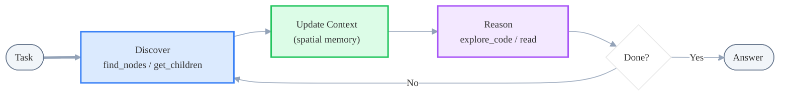
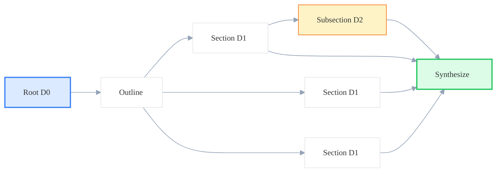
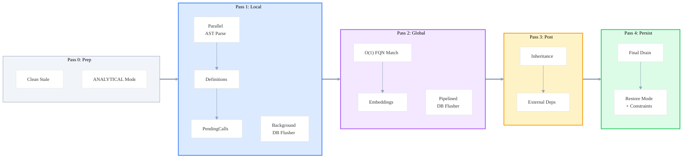
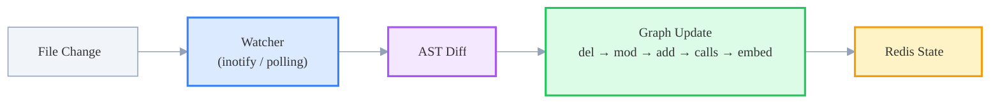
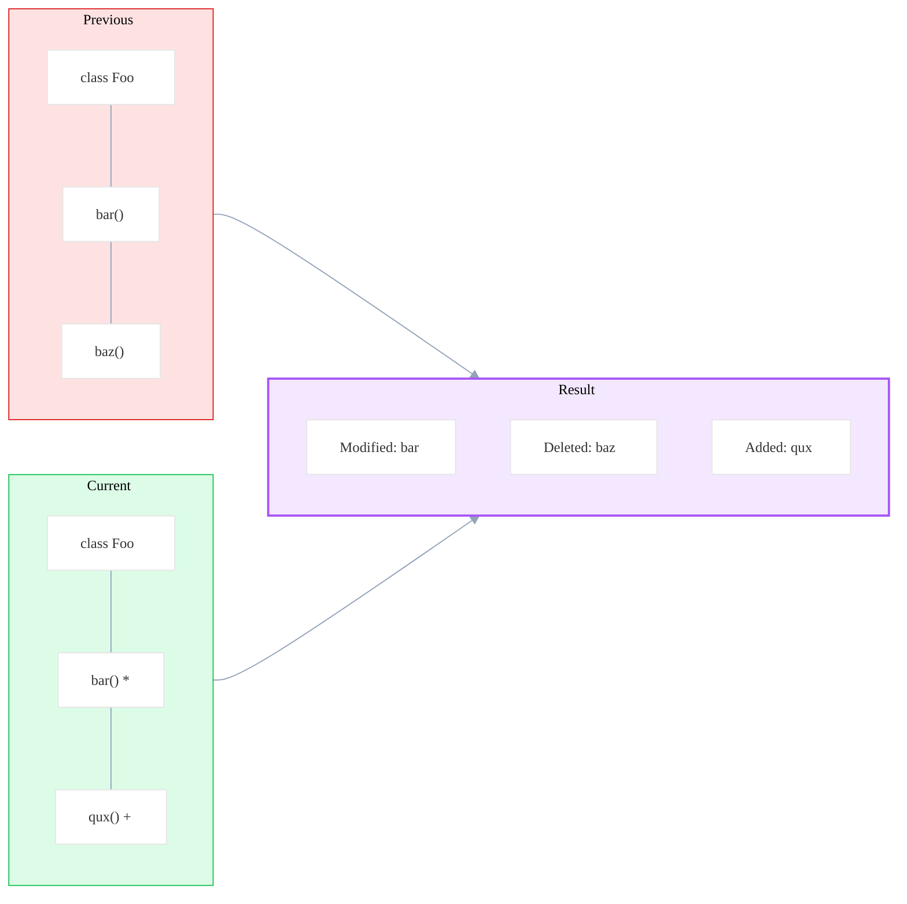

# 🛠️ AtCode: Technical Deep Dive

This document provides a detailed technical explanation of the core mechanisms that drive AtCode, focusing on Agent Design and the Knowledge Graph lifecycle.

---

## 📖 Table of Contents

- [🧠 Agent Design](#-agent-design)
  - [1. Dual Orchestrator Architecture](#1-dual-orchestrator-architecture)
  - [2. Core Agent Capabilities (Shared)](#2-core-agent-capabilities-shared)
  - [3. Orchestrator Specializations](#3-orchestrator-specializations)
- [🕸️ Knowledge Graph Lifecycle](#️-knowledge-graph-lifecycle)
  - [Construction Pipeline](#construction-pipeline)
  - [Incremental Updates and Sync](#incremental-updates-and-sync)
  - [Core Relationship Schema](#core-relationship-schema)
- [📚 Key Concepts Glossary](#-key-concepts-glossary)

---

## 🧠 Agent Design

AtCode employs a sophisticated Agent architecture built on [LangGraph](https://langchain-ai.github.io/langgraph/), specifically designed for deep code analysis and automated documentation.

### 1. Dual Orchestrator Architecture

AtCode separates concerns between interactive chat and long-running documentation tasks.

| Orchestrator | Optimization | Core Responsibility |
| :--- | :--- | :--- |
| **ChatOrchestrator** | Low-latency, Streaming | Interactive Q&A, session persistence, and real-time exploration. |
| **DocOrchestrator** | High-throughput, Parallel | Recursive documentation generation, depth-aware mapping. |

### 2. Core Agent Capabilities (Shared)

All AtCode agents share a set of baseline capabilities that enable robust reasoning over complex codebases.

#### **Tool System**
The agent's tools fall into three tiers, from broad discovery to deep analysis:

| Tool | Role | Key Behavior |
| :--- | :--- | :--- |
| `find_nodes` | **Discovery** — entry point | Exact / pattern / regex search over indexed graph; avoids file-by-file scans. |
| `find_calls` | **Discovery** — call graph | Traces outgoing (what does X call?) or incoming (who calls X?) edges with configurable depth. |
| `get_children` | **Discovery** — hierarchy | Zooms in: Folder → Files, File → Classes & Functions, Class → Methods. |
| `get_code_snippet` / `read` | **Inspection** | Retrieves source code or raw file content (configs, docs, non-code files). |
| `explore_code` | **Deep analysis** | One-stop call: returns source + callers + callees + dependency tree in a single context. |

#### **Path Awareness & Spatial Memory**
Unlike traditional RAG systems that retrieve isolated snippets, AtCode agents "walk" the code graph. To prevent them from getting lost and to enable cross-file reasoning, we implement **Spatial Memory**.

##### **Dependency Tree Perception**
Explored nodes are not maintained as a flat list. Instead, they are organized into a **dynamic dependency tree** to preserve relational context:

- **Structural Lineage**: The system tracks the hierarchical path of exploration (e.g., *Module → Class → Method → Call Site*). This records the lineage of exploration, helping the LLM understand the structural relationships between explored nodes.
- **Topological Injection**: The most recent 10-15 nodes from this tree are dynamically injected into the **System Prompt** as Qualified Names (QN) and Types.
- **Neighborhood Context**: This enables the LLM to "see" the relative positions of functions and classes, allowing it to reason about complex call chains and architectural patterns without redundant context retrieval.

##### **Agent Exploration Loop**
Tools and spatial memory form a closed loop — each tool call updates the agent's position in the graph, and the updated context informs the next tool choice.

#### **Adaptive Budgeting & Convergence**
To ensure task convergence and optimize cost, AtCode implements an adaptive budgeting mechanism that shifts the agent's strategy as resources are consumed.

##### **Convergence Workflow (Strategy Shift)**
As exploration progresses, the agent's behavior shifts from **divergent discovery** to **convergent answering**:
1.  **Discovery Phase**: The agent uses discovery tools to map the landscape.
2.  **Low Budget Signal**: When the budget drops below 30%, the system injects a `⚠️ LOW BUDGET` warning into the prompt.
3.  **Consolidation Shift**: The agent is explicitly instructed to stop calling discovery tools and prioritize **summarizing existing context** to form a final answer.
4.  **Hard Stop**: If the budget reaches zero, the system forces a response without tool access, ensuring the agent finishes the task.

#### **Intelligent Context Management**
Long-running sessions accumulate tool messages. When uncompressed tool messages exceed a threshold (default: 20), the system compresses them into a single **Context Node** to keep the context window lean.

| Step | What happens |
| :--- | :--- |
| **Count** | Only uncompressed tool messages are counted; existing Context Nodes are excluded. |
| **Classify** | An LLM labels each message: **KEEP** (core implementation, retained in full), **EXTRACT** (useful facts, summarized), or **MINIMAL** (exploratory noise, discarded). |
| **Replace** | The 20 messages are batch-replaced by one Context Node; the counter resets. |
| **Below threshold** | Nothing happens — full fidelity is preserved for immediate reasoning. |

### 3. Orchestrator Specializations

While sharing core capabilities, each orchestrator is tuned for its specific operational domain.

#### **ChatOrchestrator**
Optimized for interactive sessions, focusing on quick response times and maintaining conversational state across multiple turns of exploration.

#### **DocOrchestrator**
Designed for high-throughput, comprehensive documentation tasks.

##### **Recursive Dispatch & Depth-Aware Budgeting**
DocOrchestrator extends ChatOrchestrator with two additions:

1. **Recursive dispatch** — The root agent generates an outline, then spawns parallel child agents for each section. Children can recurse further for subsections. Each child **inherits parent context** (message history + spatial memory), so architectural awareness is preserved at every depth.

2. **Depth-aware budgeting** — Each depth level gets a tool-call budget to balance breadth vs. detail:

| Depth | Budget (overview / detailed) | Shift to consolidation |
| :--- | :---: | :--- |
| 0 (Root) | 40 / 40 | < 30% remaining |
| 1 (Section) | 30 / 30 | < 30% remaining |
| 2 (Subsection) | 30 / 30 | < 30% remaining |
| 3+ (Deep) | 10 / 30 | < 30% remaining |

---

## 🕸️ Knowledge Graph Lifecycle

AtCode transforms raw source code into a high-fidelity Knowledge Graph using a multi-pass parsing strategy designed for large repositories.

Concrete wall-clock time depends on the repository being indexed, its language mix, whether embeddings are enabled, the Memgraph deployment mode, and the available CPU cores and memory. This section therefore focuses on the final pipeline design and user-visible effects rather than fixed benchmark numbers without hardware and repository context.

### Construction Pipeline

AtCode does not try to build the entire graph in one sweep. It splits the work into a small number of passes so each stage can focus on one job: prepare storage, extract local structure, resolve cross-file links, refine relationships, and then restore the database to its normal serving mode.

At a high level, a full build follows this sequence:

1. Prepare the repository and database for bulk ingest
2. Parse files and collect definitions in parallel
3. Resolve cross-file calls and semantic data
4. Add higher-level relationships such as overrides and external dependencies
5. Flush remaining writes and restore normal query-time settings

The five passes are easier to read as roles rather than as implementation trivia:

| Pass | Main Goal | What Happens | Output |
| :--- | :--- | :--- | :--- |
| **0. Prep** | Ready the system for bulk ingest | Clean stale project data, switch Memgraph into `IN_MEMORY_ANALYTICAL`, drop constraints temporarily, and skip low-value directories such as tests, examples, docs, and caches | A clean build target and a write-optimized database mode |
| **1. Local extraction** | Discover structure file by file | Parse source files in parallel, extract definitions and imports, collect `PendingCall` records, and buffer writes in the background | Function registry, simple-name index, and unresolved cross-file call records |
| **2. Global resolution** | Connect repository-wide relationships | Resolve `PendingCall` records with `simple_name_lookup`, generate embeddings, and continue pipelined writes | A graph with cross-file calls and semantic vectors attached |
| **3. Refinement** | Add higher-level semantics | Compute `OVERRIDES` edges and map third-party or stdlib references to external dependency nodes | A richer graph that captures inheritance and external usage |
| **4. Restore** | Return to normal serving state | Drain remaining writes, switch back to `IN_MEMORY_TRANSACTIONAL`, and recreate constraints and indexes | A query-ready graph in normal operational mode |

Some implementation choices matter because they shape the behavior users see:

| Mechanism | Observable Effect | Notes |
| :--- | :--- | :--- |
| **Parallel parsing** | Better CPU utilization during structure discovery | Worker count is derived from available CPU resources and can be overridden. |
| **Background and pipelined flushing** | Parsing and persistence can overlap instead of blocking each other phase-by-phase | Especially useful when node and relationship writes are both heavy. |
| **Dictionary-backed call resolution** | Global call binding scales with extracted symbol tables rather than repeated linear scans | Based on the `simple_name_lookup` index built in Pass 1. |
| **ANALYTICAL bulk-write mode** | Full builds can temporarily favor ingest throughput over transactional behavior | Constraints are dropped before the switch and recreated afterward. |
| **Write-strategy split for full vs incremental builds** | Full rebuilds and partial updates can use different persistence strategies | Full builds can assume append-style ingest; incremental updates stay conflict-safe. |
| **Input filtering** | The parser spends less effort on directories that do not improve graph quality | Common examples are tests, examples, generated files, and cache directories. |
| **Persisted caches and IDs** | Later passes and follow-up sync operations can reuse metadata instead of rediscovering everything | Used in both build and sync flows. |

### Incremental Updates and Sync

After the initial build, AtCode keeps the graph up-to-date through **incremental rebuilds** (batch) and **live sync** (real-time). Both avoid full rescans by diffing at the file-hash or AST-definition level.

#### Overview

#### Core Components

| Component | What it does |
| :--- | :--- |
| **IncrementalBuilder** | Compares file hashes against `data/incremental_state/{project}.json`; only added / modified / deleted files enter the pipeline. |
| **File Watcher** | `inotify` (Linux) or `FSEvents` (macOS) for local FS; falls back to `PollingObserver` for NFS/CIFS. Debounces rapid saves, filters `node_modules`/`__pycache__`/hidden dirs. |
| **AST Diff Engine** | Parses old and new file with Tree-sitter, compares definitions by qualified name + source hash — detects added / modified / deleted at the function/class level, not just file level. |
| **Graph Updater** | Applies changes in order: Delete → Update → Add → Rebuild CALLS → Embed (optional async). |
| **Redis State** | Tracks watcher task IDs, distributed locks, task status, and file hash caches for multi-worker consistency. |
| **Cancellation** | `GraphUpdater` checks a cancellation flag between passes and file batches; on cancel it stops the flusher and restores storage mode. |

#### AST-Level Diff (reference diagram)

#### Operational Behavior

| Scenario | Behavior |
| :--- | :--- |
| Single-file edit | Only affected definitions are updated; no full rebuild. |
| Rapid saves (batch) | Debounced and coalesced into one update cycle. |
| Sync was offline | On restart with `initial_sync=True`, compares current files against cached hashes to catch offline changes. |
| Multi-worker deploy | Redis locks prevent race conditions; task IDs ensure only one worker watches a project. |
| Embeddings | Can run inline, be skipped, or be generated asynchronously — trade freshness against throughput. |

### Core Relationship Schema

| Relationship | Pass | Description |
| :--- | :---: | :--- |
| `CONTAINS_FOLDER` | 1 | Links parent directory to child directory. |
| `CONTAINS_FILE` | 1 | Links directory to a source file. |
| `DEFINES` | 1 | Links file to a Class or top-level Function. |
| `DEFINES_METHOD` | 1 | Links Class to its internal Methods. |
| `IMPORTS` | 1 | Tracks module-level requirements and aliases. |
| `INHERITS` | 1 | Tracks OO inheritance and interface implementation. |
| `CALLS` | 2 | **Primary link**: Connects caller site to resolved callee definition. |
| `BINDS_TO` | 2 | Special relationship for Python-C++ bindings (e.g., pybind11). |
| `OVERRIDES` | 3 | Explicitly marks method overriding in class hierarchies. |

---

## 📚 Key Concepts Glossary

| Term | Definition |
| :--- | :--- |
| **AST** | Abstract Syntax Tree - A tree representation of the abstract syntactic structure of source code. |
| **FQN** | Fully Qualified Name - A unique identifier for a code element (e.g., `repo.module.class.method`). |
| **RAG** | Retrieval-Augmented Generation - A technique that enhances LLM responses with retrieved context. |
| **Knowledge Graph** | A network of entities and their relationships, used here to represent code structure. |
| **Orchestrator** | A high-level agent that coordinates multiple sub-agents or tools to complete a task. |
| **Spatial Memory** | A mechanism for agents to track their "location" and "neighborhood" within the code graph. |
